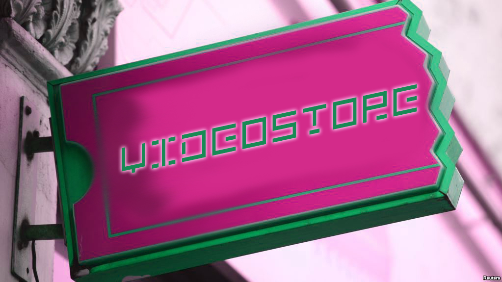
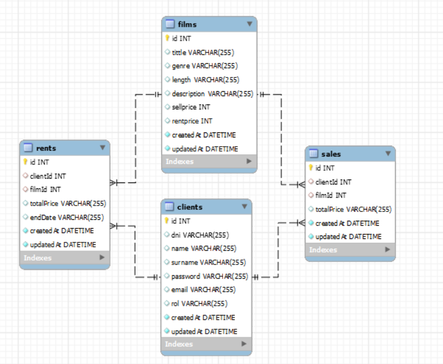

<h1 align="center">
 📼Videostore📼
</h1>

<h3 ><em> Created by: </em></h3>
 
<em> - Jackson Almeida Da Luz - </em>

<h4 align="center">created with <em>Node.js</em> and <em>Sql</em></h4>

    <a href="">Description</a> 
    -
   
  <a href="">ERD</a> 
    -
   
  <a href="">Dependencies</a> 
    -
   
  <a href="">Endpoints</a> 
    -
   
  

 
<h2>Description</h2>
Videostore is a simulated shopping in which you could buy and rents movies.
It could be more complexed but for learning reasons I decided to keep it simple, just enough to practice technologies I described.
 
 

<h2>ERD</h2>

 
Relations [Many to Many]

<h2>Dependecies:</h2>
<ul>
<li>express</li>
<li>sequelize</li>
<li>sequelize-cli</li>
<li>mysql2</li>
<li>jsonwebtoken</li>
<li>nodemon</li>
<li>dotenv</li>
<li>bcrypt</li>
</ul>

<h2>Endpoints:</h2>

 

<ins>| CLIENTS |</ins>
 
| /clients/    | <-- get
| /clients/:id       | <-- get
| /clients/:id       | <-- put
| /clients/:id/changepassword      | <-- put
| /clients/register      | <-- post
| /clients/login      | <-- post
 

<ins>| FILMS |</ins>
 
| /films/    | <-- get
| /films/addfilm       | <-- post
| /films/:tittle       | <-- get
| /films/genre     | <-- get

 

<ins>| SALES |</ins>
 
| /sales/    | <-- get
| /sales/buy      | <-- post

 

<ins>| RENTS |</ins>
 
| /rents/    | <-- get
| /rents/rent     | <-- post

 
